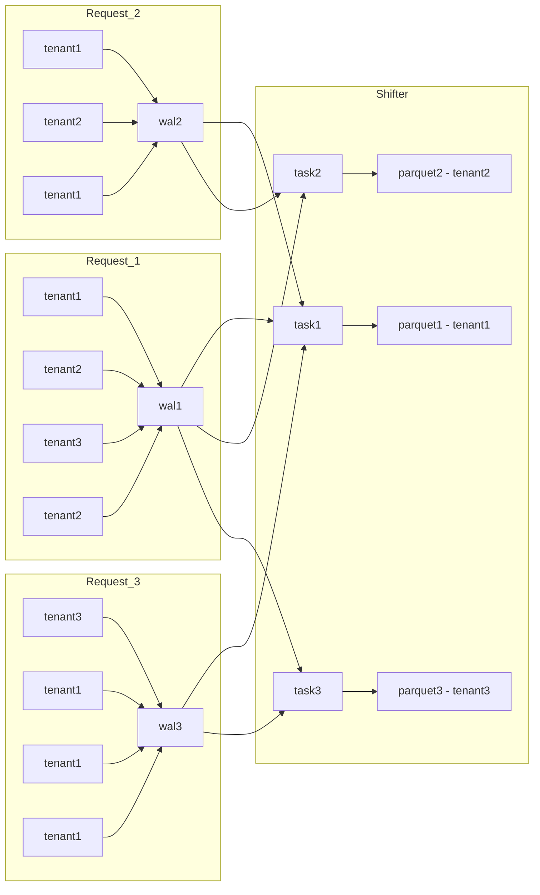

# Tenancy mode

The `tenant` key of the ingest configuration decides which tenant an OTLP request
writes to, on the request's headers alone — before the body is decompressed or
decoded. There is no fallback: a request the policy cannot resolve is refused,
and nothing reaches the WAL.

The policy is `TenantPolicy` / `TenantResolver` in
[`icegate-common`](../icegate-common/src/tenant.rs), whose doc comments carry the
decision table of both modes, the identifiers a tenant may be named by, and what
a configuration with no `tenant` section means. It is applied by
[`otlp_http/tenant.rs`](src/otlp_http/tenant.rs) — a layer above decompression —
and by [`otlp_grpc/tenant.rs`](src/otlp_grpc/tenant.rs) — an interceptor above
the protobuf decode; each names the status its own protocol answers a refusal
with, and both meter it through `OtlpMetrics::add_tenant_rejection`
([`infra/metrics.rs`](src/infra/metrics.rs)).

What none of them can state, because it belongs to the deployment rather than to
the resolver: `!multi` takes the tenant from whoever reaches the port, so it
belongs behind an auth proxy that authenticates the sender and writes
`x-scope-orgid` itself. Without one, any client on the network chooses the tenant
it writes to.

Any proxy in front of the receivers has a floor on its upstream timeout: an OTLP
request is answered only once the batch is durable in the WAL, so a proxy that
gives up before `WAL_ACK_TIMEOUT` (`src/wal/writer.rs`) reports a failure for a
write that still commits, and the sender's retry writes the batch twice. This
holds for an ingress controller's read timeout as much as for a sidecar's route
timeout. A deployment example that respects it, checked against that constant by
`make helm-metadata-test`, is [`config/helm/auth-proxy`](../../config/helm/auth-proxy/README.md).

## Checking the auth proxy on the dev stand

`make run-docker-proxy-release` brings the stand up with the Envoy sidecar in
front of ingest (`config/docker/docker-compose.proxy.yml`): the proxy owns the
OTLP ports the `ingest` service publishes, icegate runs `!multi` on the loopback
addresses of `config/docker/ingest-proxy.yaml`, and the proxy writes
`x-scope-orgid` from the ingest token's `tenant_id` claim. `/health` stays on the
operational listener, so it keeps reporting icegate's own health while the proxy
owns the published OTLP ports.

The header of `config/docker/auth-proxy/envoy.yaml` states which of its
issuer-specific values are placeholders to be pointed at yours, and why its
listeners carry no TLS while the deployment example's
(`config/helm/auth-proxy/configmap-envoy.yaml`) do — the reason
`scripts/authproxy-test.sh` runs the example's cases over `https` and the stand's
over `http`.

Nothing on the stand mints a token, so both of its OTLP senders are refused while
the proxy is up:

- `otelgen` presents no token, and the `load` profile does not combine with this
  overlay at all;
- `otel-collector` belongs to no profile and keeps running, so every export it
  makes is answered `401`. The stand's own logs and traces stop reaching the
  tables, and the `Loki (demo)` / `Tempo (demo)` datasources in Grafana stay
  empty until a token is put into `config/docker/otel-collector/config.yaml`
  under `exporters.otlphttp.headers`.

`make authproxy-test` runs `scripts/authproxy-test.sh`, which pins the proxy's
own rules against a self-contained token issuer; its header lists them.

# Per-tenant task model
Data flow: Client -> Ingestor -> WAL -> Shifter (multiple tasks) -> Iceberg.

## Ingestor's tasks
- Minimize the number of requests to S3. Moreover, the priority is to minimize file write requests (in AWS, writing is 10 times more expensive than reading).
- Do not delay the response to the client and guarantee data recording (respond only after WAL recording).

## Core rules
- each Ingest request is appended to a single WAL file.
- Shifter creates one task per tenant (partition).
- Each task produces one Parquet file for its tenant (partition).
- A task reads only WAL files that contain data for its tenant (partition).

## Read/write example
- wrote 3 WAL files
- read WAL files 7 times (fan-out to multiple tenants)
- wrote 3 Parquet files

