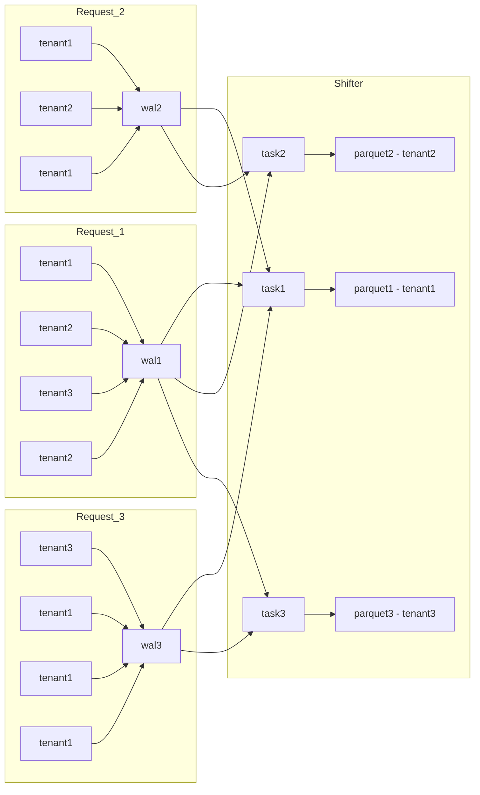

# Tenancy mode

The `tenant` key of the ingest configuration decides which tenant an OTLP
request writes to, on the request's headers alone — before the body is
decompressed or decoded. There is no fallback: a request the policy cannot
resolve is refused, and nothing reaches the WAL.

| `tenant` | no `x-scope-orgid` | header names the configured tenant | header names another tenant | header appears twice |
|---|---|---|---|---|
| `!single` with `id` | writes to `id` | writes to `id` | refused | refused |
| `!multi` | refused | — | writes to the header value | refused |

A header value is usable when it is non-empty and consists of ASCII
alphanumerics, hyphens, and underscores; anything else is refused as well.
`!single` consults the header rather than ignoring it, so a sender addressing
another tenant is refused instead of silently written to `id`. Omitting the
`tenant` key gives `!single` on `default`, which is what ingest wrote to before
the policy existed.

A refusal is `400` with `errorType: "bad_data"` on OTLP/HTTP and
`INVALID_ARGUMENT` on OTLP/gRPC, and increments
`icegate_ingest_otlp_tenant_rejections` with labels `protocol`, `signal`, and
`reason` (`missing`, `invalid`, `duplicate_header`). On OTLP/HTTP the request
body is drained before the status is written, so a client that has already begun
uploading reads the status instead of a connection reset.

`!multi` takes the tenant from whoever reaches the port, so it belongs behind an
auth proxy that authenticates the sender and writes the header itself. Deployed
without one, it lets any client on the network choose the tenant it writes to.

## Checking the auth proxy on the dev stand

`make run-docker-proxy-release` brings the stand up with the Envoy sidecar in
front of ingest (`config/docker/docker-compose.proxy.yml`): the proxy owns the
OTLP ports the `ingest` service publishes, icegate runs `!multi` on the loopback
addresses of `config/docker/ingest-proxy.yaml`, and the proxy writes
`x-scope-orgid` from the ingest token's `tenant_id` claim. `/health` stays on the
operational listener, so it keeps reporting icegate's own health while the proxy
owns the published OTLP ports.

The header of `config/docker/auth-proxy/envoy.yaml` states which of its
issuer-specific values are placeholders to be pointed at yours, and why its
listeners carry no TLS while the chart's
(`config/helm/icegate/templates/configmap-authproxy.yaml`) do — the reason
`scripts/authproxy-test.sh` runs the chart's cases over `https` and the stand's
over `http`.

Nothing on the stand mints a token, so both of its OTLP senders are refused while
the proxy is up:

- `otelgen` presents no token, and the `load` profile does not combine with this
  overlay at all;
- `otel-collector` belongs to no profile and keeps running, so every export it
  makes is answered `401`. The stand's own logs and traces stop reaching the
  tables, and the `Loki (demo)` / `Tempo (demo)` datasources in Grafana stay
  empty until a token is put into `config/docker/otel-collector/config.yaml`
  under `exporters.otlphttp.headers`.

`make authproxy-test` runs `scripts/authproxy-test.sh`, which pins the proxy's
own rules against a self-contained token issuer; its header lists them.

# Per-tenant task model
Data flow: Client -> Ingestor -> WAL -> Shifter (multiple tasks) -> Iceberg.

## Ingestor's tasks
- Minimize the number of requests to S3. Moreover, the priority is to minimize file write requests (in AWS, writing is 10 times more expensive than reading).
- Do not delay the response to the client and guarantee data recording (respond only after WAL recording).

## Core rules
- each Ingest request is appended to a single WAL file.
- Shifter creates one task per tenant (partition).
- Each task produces one Parquet file for its tenant (partition).
- A task reads only WAL files that contain data for its tenant (partition).

## Read/write example
- wrote 3 WAL files
- read WAL files 7 times (fan-out to multiple tenants)
- wrote 3 Parquet files

