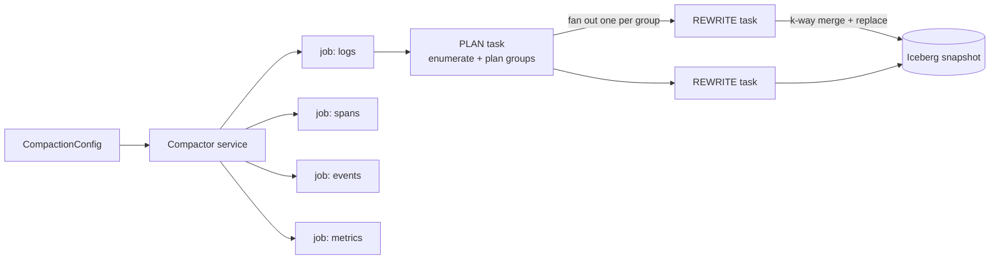
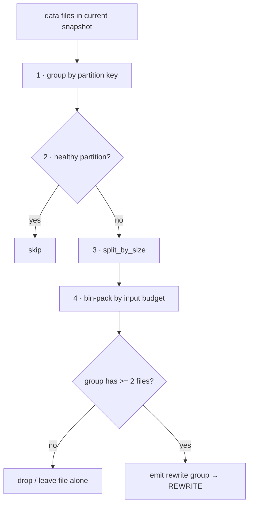
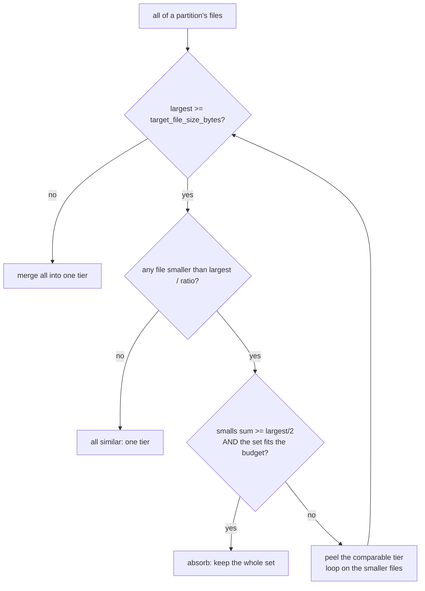

# Parquet compaction

Compaction rewrites the many small Parquet files that ingest leaves in an
Iceberg table into fewer, larger, target-sized files, so queries scan fewer,
larger objects. It runs as a long-running background service (`maintain run`),
never blocks ingest, and commits its work as atomic Iceberg `replace` snapshots.

- Code: [`mod.rs`](mod.rs) (service), [`planner.rs`](planner.rs) (which files to
  rewrite), [`rewrite.rs`](rewrite.rs) (how they are merged), [`config.rs`](config.rs).
- Design: [`docs/superpowers/specs/2026-06-11-parquet-compaction-design.md`](../../../../docs/superpowers/specs/2026-06-11-parquet-compaction-design.md)
  and [`...-2026-06-14-compaction-size-aware-grouping-design.md`](../../../../docs/superpowers/specs/2026-06-14-compaction-size-aware-grouping-design.md).

## Service architecture

One jobmanager job per enabled table (`logs`, `spans`, `events`, `metrics`).
Each job is a `PLAN → REWRITE` pipeline. The PLAN task decides *what* to rewrite;
each REWRITE task it fans out does the merge and commits its own replace.



- **PLAN** loads the table fresh, enumerates its data files with per-column
  sort-key bounds, calls [`plan_rewrite_groups`](planner.rs), and dynamically
  fans out one REWRITE task per group. It schedules no commit task.
- **REWRITE** k-way-merges its group's already-sorted inputs into target-sized
  Parquet and atomically swaps inputs for outputs via Iceberg
  `Transaction::rewrite_files`, with optimistic-concurrency retry handled by the
  generic catalog (so concurrent ingest commits are tolerated).

## The planning pipeline

[`plan_rewrite_groups`](planner.rs) runs four stages per partition. Stages 1 and
4 are structural; stages 2 and 3 decide what is worth rewriting. (There is no
sort-key clustering stage — see [Guarantees and limitations](#guarantees-and-limitations).)



| Stage | Function | Purpose |
|-------|----------|---------|
| 1 | `group_by_partition` | Never merge across `(tenant, day)` partitions. |
| 2 | `is_healthy` | Skip partitions with few files and no sub-target tail. |
| 3 | `split_by_size` | Keep size-similar files together (see below); no sort-key clustering. |
| 4 | `bin_pack_into` + `retain(len >= 2)` | Cap each group at `max_group_input_bytes`, then drop single-file groups (the convergence guard). |

**Why the single-file drop matters:** rewriting one file 1-to-1 reduces nothing,
so emitting a single-file group would make every scan re-rewrite the same file
forever. A partition left with only single-file groups is reported as *skipped*,
not compacted.

## Inside `split_by_size`

This is the only stage with real size policy. Its goal: **merge files of similar
size, and never re-read a large, near-target file just to absorb a few small
ones.** It loops, peeling one size tier at a time.



Three rules, in order:

1. **Target shortcut** — if even the largest file is *below* target, re-reading
   it is cheap and merging shrinks the file count, so merge everything. This is
   the common case (a partition of small files from WAL shift).
2. **Ratio gate** (`max_merge_size_ratio`) — above target, a file joins the
   largest's tier only when `size * ratio >= largest` (i.e. it is at least
   `1/ratio` of the largest). Smaller files drop to lower tiers.
3. **Absorb override** — pull the small files into the large one anyway when they
   collectively reach half the largest **and** the whole set fits one rewrite
   group. The fit check prevents the bin-packer from later stranding a file.

### Ratio gate vs. absorb gate

These are two different questions that happen to share the same `largest / 2`
line under the defaults (`ratio = 2`). The difference is **what** is measured
against the line:

```text
largest = 200K

  ratio gate  -> asks EACH file:            absorb gate -> asks the SUM of smalls:
  "is this one file >= largest/ratio?"      "do all smalls together >= largest/2?"

  200K ############  comparable
  ---- ---------------------------- largest/2 = 100K (the line) -------------------
   60K ###   small  ┐
   60K ###   small  ├─ sum = 140K  >= 100K  -> absorb*  (*only if the set fits budget)
   20K #     small  ┘
```

- `max_merge_size_ratio` is **configurable** and looks at **one file at a time**
  (tier membership).
- `LARGE_FILE_ABSORB_DENOMINATOR` is a **hard-coded** `2` (one half) and looks at
  the **sum of the small files** (is the merge worth the re-read).

Change `ratio` to 3 and they diverge: a file is "small" below `largest/3`, but
absorb still triggers at `sum >= largest/2`.

## Worked example

One partition, `target = 100K`, `ratio = 2`, `budget = 250K`, `min_input_files =
4`. Six files (the sort-key ranges are shown but no longer affect grouping):

```text
input                 split by size (stage 3)        bin-pack + drop (stage 4)
200K [10-40]   ┐      tier {200K}              ->     dropped (lone, left alone)
 60K [12-38]   │
 60K [13-37]   ├ ->   tier {60,60,20,20,20}    ->     group (1): 180K
 20K [14-36]   │
 20K [50-70]   │
 20K [52-68]   ┘
```

The partition (6 files > `min_input_files`) walks the `split_by_size`
loop:

- **iteration 1** — largest `200K >= target`, so the gate runs. The five smalls
  (60, 60, 20, 20, 20) sit below the `100K` line; their sum is `180K (>= 100K)`,
  but the whole set is `380K > 250K` budget, so absorb does **not** fire. The
  `200K` tier is peeled off; the loop continues on `{60, 60, 20, 20, 20}`.
- **iteration 2** — largest is now `60K < target`, so the shortcut merges all
  five into one tier (`180K <= 250K` budget → one group).

Result: one rewrite group (`180K`); the `200K` file is never re-read.

Note the two sort-key-disjoint sets of small files (`[10-40]` and `[50-70]`)
**merge into one output** — the planner no longer clusters by sort-key, so the
merged output spans both ranges. The REWRITE k-way merge still produces a sorted
output; the cost is weaker per-file pruning for this partition.

## Configuration

Defaults live in [`config.rs`](config.rs); Helm keys in
[`config/helm/icegate/values.yaml`](../../../../config/helm/icegate/values.yaml)
under `compact.compaction`.

| Field (`snake_case`) | Helm (`camelCase`) | Default | Meaning |
|----------------------|--------------------|---------|---------|
| `target_file_size_bytes` | `targetFileSizeBytes` | 128 MiB | Desired output file size; below this a file is "sub-target". |
| `max_group_input_bytes` | `maxGroupInputBytes` | 256 MiB | Max summed input a single rewrite may read. |
| `min_input_files` | `minInputFiles` | 4 | A partition at or below this is a skip candidate. |
| `max_skippable_tail_files` | `maxSkippableTailFiles` | 0 | Tolerated sub-target files in a skip candidate. |
| `max_merge_size_ratio` | `maxMergeSizeRatio` | 2 | Largest-to-smallest size ratio within one group. Must be `>= 1` (rejected at startup otherwise). |
| `scan_interval_secs` | `scanIntervalSecs` | 300 | Discovery loop period. |
| `rewrite_timeout_secs` | `rewriteTimeoutSecs` | 3600 | Deadline for one REWRITE task. |
| `worker_count` | `workerCount` | half of CPUs | Concurrent REWRITE workers. |
| `{logs,spans,events,metrics}_enabled` | `…Enabled` | true | Per-table toggles. |

`LARGE_FILE_ABSORB_DENOMINATOR` (the absorb half-rule) is a module constant, not
configurable in this iteration.

## Guarantees and limitations

- **Convergence.** The single-file-group drop (stage 4) guarantees the planner
  never spins on a file that cannot beneficially merge.
- **No cross-partition merges.** All files in a rewrite group share one
  `(tenant, day)` partition.
- **No sort-key clustering.** Files with disjoint sort-key ranges in the same
  partition may be merged into one output, whose range then spans them — this
  weakens per-file pruning for that partition, and can merge already-over-target
  disjoint files (a one-off, slightly wasteful rewrite). The REWRITE k-way merge
  still produces a sorted output, and the single-file-group drop still prevents an
  infinite 1-to-1 rewrite loop.
- **Accepted trade-off.** Leaving an over-target file out of the merge means the
  small files' merged output overlaps it in sort-key range, weakening pruning for
  that partition in exchange for not re-reading the large file.
- **Known gap (`TODO(closed-partition)`).** A cold partition whose largest file
  is over target and whose small tail sums to less than half will not converge to
  a single file — the large file escapes the gate each scan and is left alone. A
  future change would detect "closed" partitions (day old enough that no further
  writes land) and bypass the size gate.
