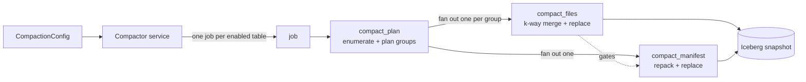

# Parquet compaction

Compaction rewrites the small files an Iceberg table accumulates — both the many
small Parquet data files that ingest leaves and the metadata manifests that track
them — into fewer, larger, target-sized ones, so queries scan and plan over fewer
objects. It runs as a long-running background service (`maintain run`), never
blocks ingest, and commits its work as atomic Iceberg `replace` snapshots.

The algorithm (which files to merge, size tiers, convergence) lives in each
module's own doc comments — this file stays at the level that no single source
file can show: how the pieces fit and which guarantees hold across them.

## Structure

Two axes: the compaction **domain** (data files vs manifests) and the **layer**
(jobmanager task → domain logic → assembly). Each domain is planner + rewrite.

| Path                           | Layer    | Where to look                                                                                       |
|--------------------------------|----------|-----------------------------------------------------------------------------------------------------|
| [`compactor.rs`](compactor.rs) | assembly | Per-table job specs and the `Compactor` service — the only module touching the jobmanager registry. |
| [`data/`](data/)               | domain   | Data-file compaction.                                                                               |
| [`manifest/`](manifest/)       | domain   | Manifest compaction.                                                                                |

## Service

One jobmanager job per enabled table. Each job is a `compact_plan →
compact_files` pipeline: `compact_plan` decides *what* to rewrite and fans out
one `compact_files` per group; each `compact_files` does its own merge and
commits its own replace, with optimistic-concurrency retry from the generic
catalog (so concurrent ingest commits are tolerated). `compact_plan` also fans
out one `compact_manifest` task, gated on those rewrites, that repacks the
manifests they leave behind.

```mermaid
flowchart LR
    CFG[CompactionConfig] --> CMP[Compactor service]
    CMP -->|one job per enabled table| J[job]
    J --> P[compact_plan<br/>enumerate + plan groups]
    P -->|fan out one per group| R[compact_files<br/>k-way merge + replace]
    P -->|fan out one| M[compact_manifest<br/>repack + replace]
    R -.->|gates| M
    R --> IC[(Iceberg snapshot)]
    M --> IC
```

## Guarantees and limitations

- **Convergence.** A group is kept only when it actually reduces the partition's
  file count (`ceil(sum_bytes / target) < len`). Single-file groups, and groups
  whose inputs are each already at/above target (`N` in → `N` out), are dropped,
  so the planner never spins re-rewriting files that cannot beneficially merge.
- **No cross-partition merges.** All files in a group share one `(tenant, day)`.
- **No sort-key clustering.** Files with disjoint sort-key ranges in one
  partition may merge into a single output whose range then spans them, weakening
  per-file pruning for that partition (the k-way merge still yields a sorted
  output). Over-target disjoint files are *not* merged: re-rolling them at target
  size reduces no file count, so the convergence guard drops the group — this is
  what prevents an infinite re-rewrite loop.
- **Known gap** ([`TODO`](data/planner.rs)). A cold partition
  whose largest file is over target and whose sub-target tail sums to less than
  half of it never converges to one file: the large file escapes the size gate
  every scan. A future change would detect "closed" partitions (day old enough
  that no further writes land) and bypass the gate.

## Configuration

Defaults live in [`config.rs`](config.rs); Helm keys in
[`config/helm/icegate/values.yaml`](../../../../config/helm/icegate/values.yaml)
under `maintain.compaction`.
