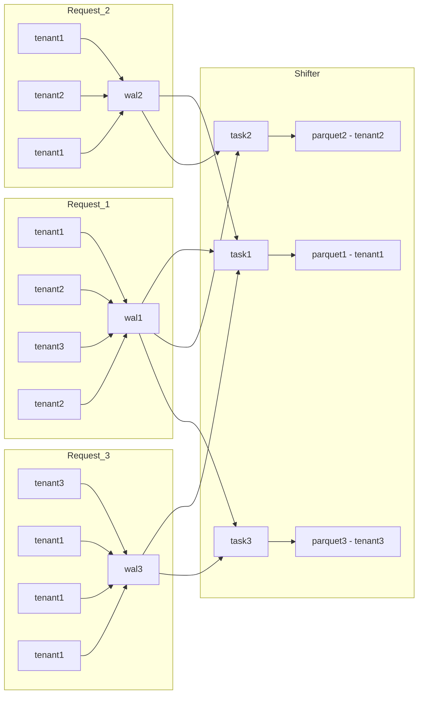

# Per-tenant task model
Data flow: Client -> Ingestor -> WAL -> Shifter (multiple tasks) -> Iceberg.

## Ingestor's tasks
- Minimize the number of requests to S3. Moreover, the priority is to minimize file write requests (in AWS, writing is 10 times more expensive than reading).
- Do not delay the response to the client and guarantee data recording (respond only after WAL recording).

## Core rules
- each Ingest request is appended to a single WAL file.
- Shifter creates one task per tenant (partition).
- Each task produces one Parquet file for its tenant (partition).
- A task reads only WAL files that contain data for its tenant (partition).

## Read/write example
- wrote 3 WAL files
- read WAL files 7 times (fan-out to multiple tenants)
- wrote 3 Parquet files

